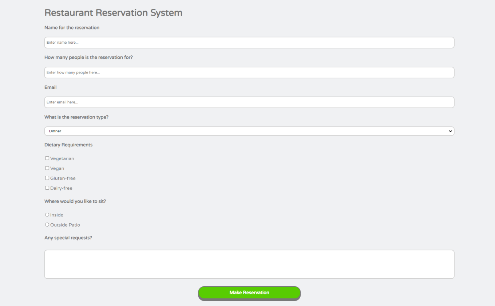
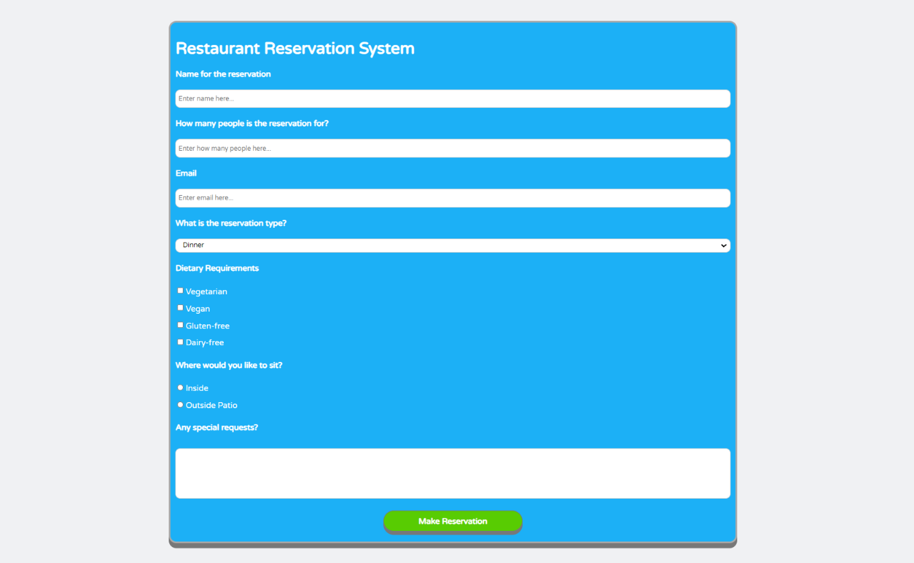

# FluentCSS

A CSS library inspired by the styles of the Duolingo and Font Awesome websites.

Check out the live [demo](https://manuel12.github.io/fluent-css/).

<!-- ## Some quick examples

### Headings

### Social buttons

### Sound buttons

 -->

## Introduction

A Brief overview of what the library does:

Inspired by the styles of the [Duolingo](https://www.duolingo.com/learn) and [Font Awesome](https://fontawesome.com/) websites, I wanted to create a library that would immediately improve the look of a website when imported but also provide the user with utility classes to alter the styles of the different elements in use.

### How the library was built:

FluentCSS was built using plain CSS and Font Awesome icons.

## Download

### How to download the library:

Simply clone the repository locally and extract the _fluent.min.css_ file.

### How to import the library:

In order to import FluentCSS, simply add the two library links to the head tag of your index.html

    <link rel="stylesheet" href="fluent.min.css" />

_This is, of course, assuming the styles are in the root of your project; if they are not, then modify their paths accordingly._

And finally, add the script for the Font Awesome kit (to be able to use Font Awesome icons).

    

## What's included in the library

FluentCSS consists of one CSS file: _fluent.min.css_

The _fluent.min.css_ file includes boilerplate stylings that will apply immediately as soon as the library is imported; it also contains some custom element styles like 'main container' or 'basic container' that serve as building blocks for your application; further utility classes regarding margin, padding, width, and height; and color classes to style text, background, and border colors:

### Some custom element styles:

- Main container
- Basic container
- Depth container
- Heading with depth
- Heading with round corners
- Submit button
- Icon buttons

### Some general style utilities

- Display styles
- Margin styles
- Padding styles
- Width styles
- Height styles
- Text styles
- Font-size styles

### Custom Colors

- Background colors
- Border colors
- Text colors

## Usage

### Adding classes to elements

After importing FluentCSS and reloading, you should see changes applied to the document. The standard background will be added; the font family and color will be updated; input elements, buttons, tables, and ordered and unordered lists will also be automatically updated.

In order to use the other styles available, such as having a heading with depth, or with darker borders, styling buttons as social or music buttons, and so on, you will need to add the class of the style you want to add to the element you want to change.

So for example, if you have a heading element that you want to update to a heading with depth and also give it a different background color...

    <html>
      <body>
        <h1>My heading</h1>
      </body>
    </html>

...that originally looked like this...

...you need to add the required classes, in this case _.heading-depth_ and _.bg-green_, to the h1 element...

    <html>
      <body>
        <h1 class="heading-depth bg-green">My heading</h1>
      </body>
    </html>

...so that it ends up looking like this:

### Custom containers

One of the most important classes provided by FluentCSS is the _.main-container_ class. With this class, you can create containers that are padded, bordered, and margined. All the examples in the "Examples" section of this README file are contained in custom containers. In order to make a normal div into a custom container, you just have to add the class _.main-container_ to such an element. As an example, we have a restaurant reservation system that is wrapped in a div...

    

      <h1>Restaurant Reservation System</h1>
      ...
    

...and currently looks like this...

...add the _.main-container_ and _.bg-blue_ classes to such a div in order to change it to a custom container with a blue background...

    

      <h1>Restaurant Reservation System</h1>
      ...
    

...and it will end up looking like this:

**Note:** Custom containers occupy 75% of their parent's width and have a white font by default.

In order to see how to apply any of the different styling examples, simply load the index.html that comes with the library and check the source code to see how each element was implemented.

## Examples

### Headings with depth

### Headings with round corners

### Headings with dark borders

### Form elements

### Button using width classes

### Social buttons

### Sound buttons

### Tables, ordered and unordered lists

