# Custom Styles & Colors Library

## Some quick examples

### Headings

### Social buttons

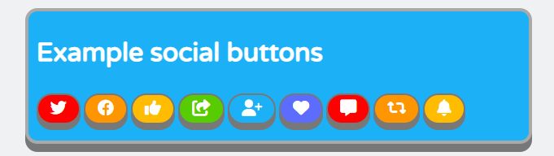

### Sound buttons

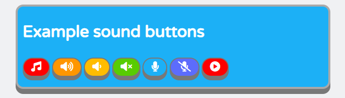

## Introduction

### Brief overview of what the library does:

This library was inspired by the styles of the [Duolingo](https://www.duolingo.com/learn) and [Font Awesome](https://fontawesome.com/) websites. I wanted to create a library that would inmeditaly improve the look of an HTML website when imported, but also provided the user with classes to alter the stylings of the different elements in use.

### How the library was built:

The library was built using plain CSS and Font Awesome icons.

## Download

### How to download the library:

Simply clone the repository locally and extract the _custom-styles.css_ and _custom-colors.css_ files and add them to the root of your project

### How to import the library:

In order to import the library simply add the two library links on the head tag of your index.html

    <link rel="stylesheet" href="custom-styles.css" />
    <link rel="stylesheet" href="custom-colors.css" />

_This is of course assuming the styles are in the root of your project, if they are not then modify their paths accodingly._

After that add the link to the google (Valera Round) font.

    <link href="https://fonts.googleapis.com/css2?family=Varela+Round&display=swap" rel="stylesheet" />

And finally add the script for the Font Awesome kit.

    

## What's included in the library

The library includes 2 CSS files: _custom-styles.css_ and _color-styles.css_.

The _custom-styles.css_ includes element stylings that will apply inmediatly as soon as library is imported and further classes that you can use to style elements:

### Custom Styles

- Elements styles
- Custom container
- Heading with depth
- Heading with round corners
- Submit button
- Social buttons
- Sound buttons
- Text styles
- Font-size styles
- Width styles

The _color-styles.css_ includes colors you can use to style elements:

### Custom Colors

- Background colors
- Border colors
- Text colors

## Usage

### Adding classes to elements

After importing the library and reloading you should see changes applied to the document. The standard background will be added; the font family and color will be updated; input elements, buttons, tables, ordered and unordered lists will also be automatically updated.

In order to use the other styles available, such as having a heading with depth, or with darker borders, styling buttons as social or music buttons, and so on, you will need to add the class of the style you want to add to the element you want to change.

So for example, if you have a heading element that you want to update to a heading with depth and also give it a different background color...

    <html>
      <body>
        <h1>My heading</h1>
      </body>
    </html>

...that originally looks like this...

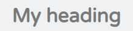

...you need to add the required classes, in this case _.heading-depth_ and _.bg-green_, to the h1 element...

    <html>
      <body>
        <h1 class="heading-depth bg-green">My heading</h1>
      </body>
    </html>

...so that it ends up looking like this:

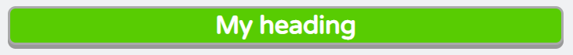

### Custom containers

One of the most important classes provided by _custom-styles.css_ is the _.custom-container_ class. With this class you can create containers that are padded, bordered and margined. All the examples in the "Examples" section are contained in custom containers. In order to make a normal div into a custom container you just have to add the class _.custom-container_ to such an element. As an example we have a restaurant reservation system that is wrapped in a div...

    

      <h1>Restaurant Reservation System</h1>
      ...
    

...and currently looks like this...

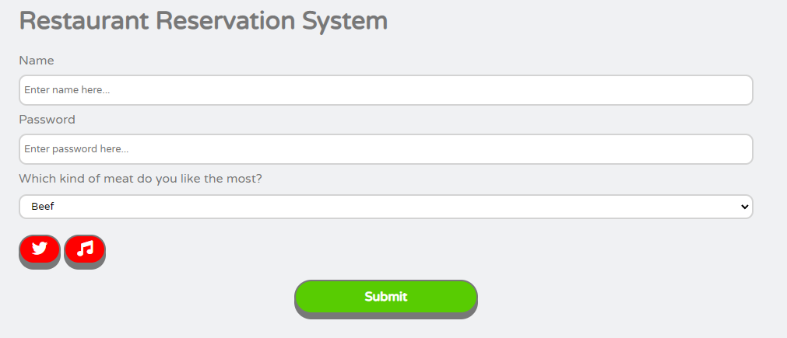

...add the _.custom-container_ and _.bg-blue_ classes to such div in order to change it to a custom container with a blue background...

    

      <h1>Restaurant Reservation System</h1>
      ...
    

...and it will end up looking like this:

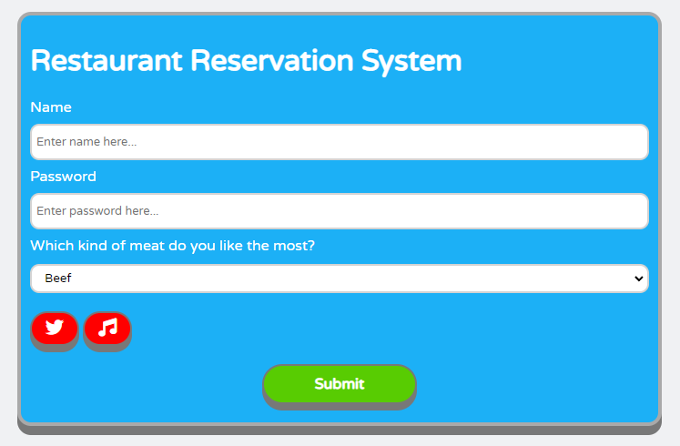

**Note:** custom containers occupy 75% of their parent's width and have white font by default.

In order to see how to apply any of the different styling examples simply load the index.html that comes with the library, and check the source code to see how each element was implemented.

## Examples

### Headings with depth

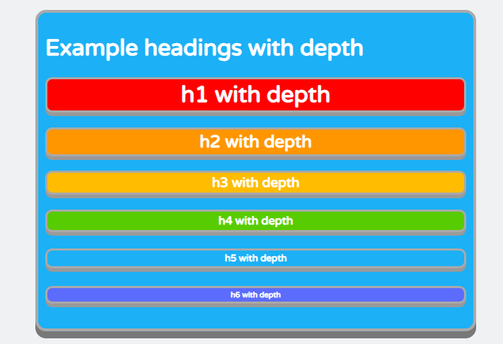

### Headings with round corners

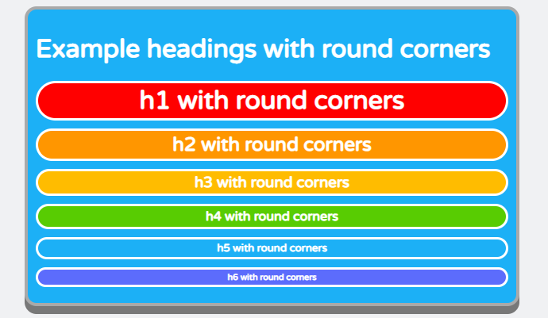

### Headings with dark borders

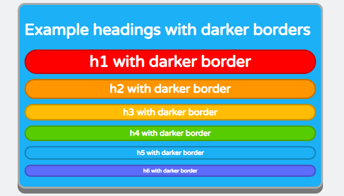

### Form elements

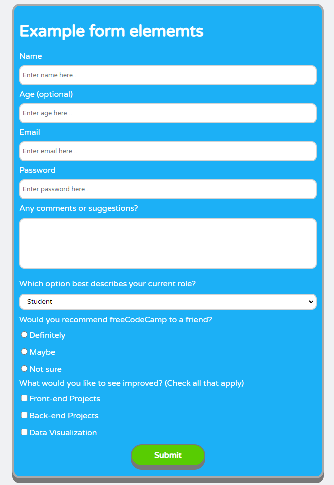

### Button width classes

### Social buttons

### Sound buttons

### Tables, ordered and unordered lists

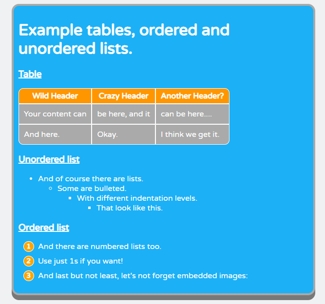
